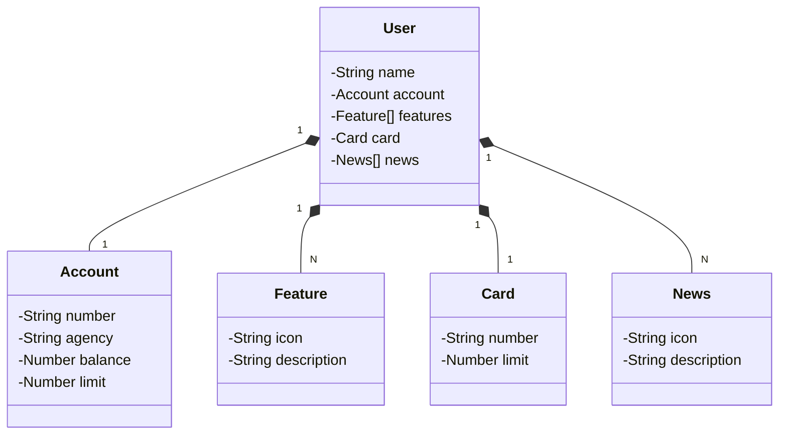

# Decola 25 Avanade - Dio

Java RESTful API criada para a Santander Dev Week.

## Principais Tecnologias
 Criar a API REST com Spring Boot 3 e Java 17:

Spring Boot 3 vai ser o "motor" da API, ajudando a criar endpoints que vão responder a requisições HTTP (como GET, POST, etc.).
Java 17 vai ser a linguagem usada para programar a API.
Hospedar na Nuvem:

A API será hospedada em um serviço de nuvem (como o Railway).
Railway para Implantar a API:

Railway facilita a implantação, configurando os servidores para rodar a API na nuvem.
A plataforma também conecta a API com o banco de dados, se necessário, e ajuda a gerenciar a API.

## [Link do Figma](https://www.figma.com/file/0ZsjwjsYlYd3timxqMWlbj/SANTANDER---Projeto-Web%2FMobile?type=design&node-id=1421%3A432&mode=design&t=6dPQuerScEQH0zAn-1)

O Figma foi utilizado para a abstração do domínio desta API, sendo útil na análise e projeto da solução.

## Diagrama de Classes (Domínio da API)

## IMPORTANTE

Este projeto foi construído com um viés totalmente educacional para a DIO. Por isso, disponibilizamos uma versão mais robusta dele no repositório oficial da DIO:

### [digitalinnovationone/santander-dev-week-2023-api](https://github.com/digitalinnovationone/santander-dev-week-2023-api)

Lá incluímos todas os endpoints de CRUD, além de aplicar boas práticas (uso de DTOs e refinamento na documentação da OpenAPI). Sendo assim, caso queira um desafio/referência mais completa é só acessar 👊🤩
